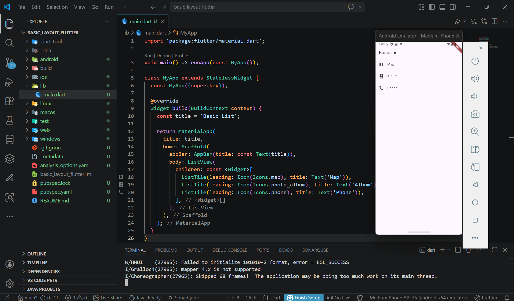
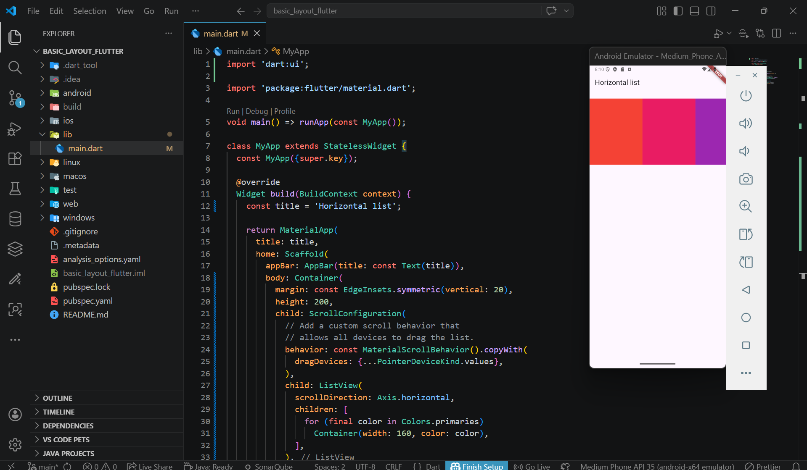
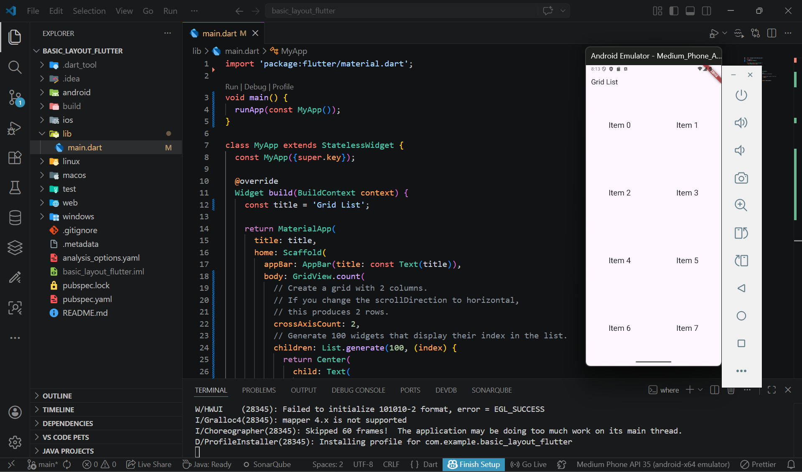
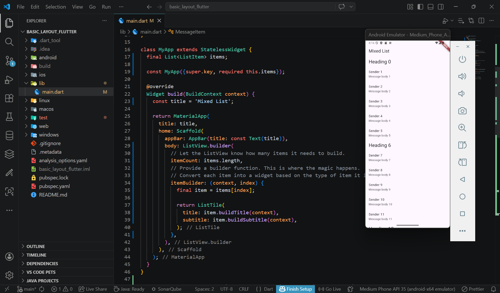
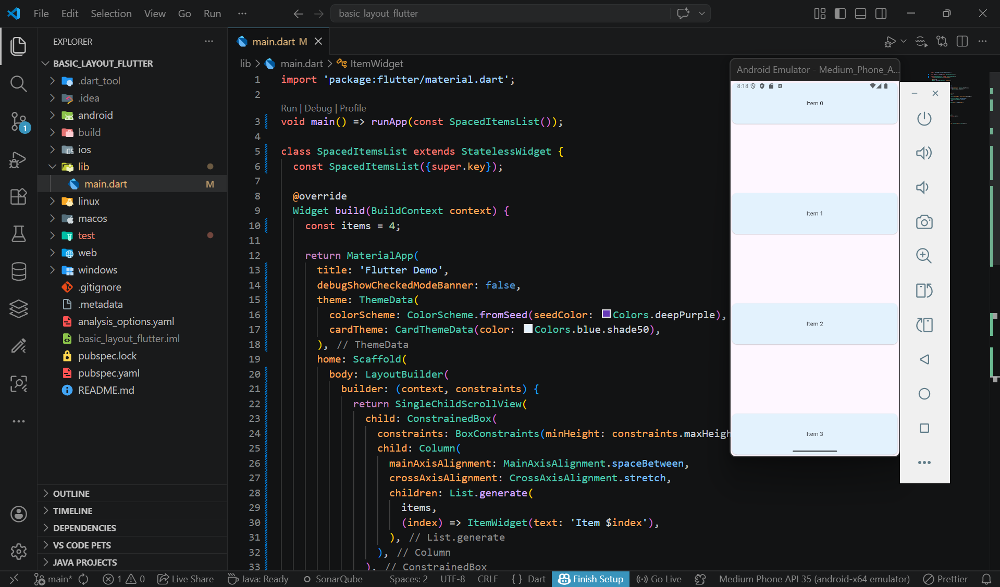
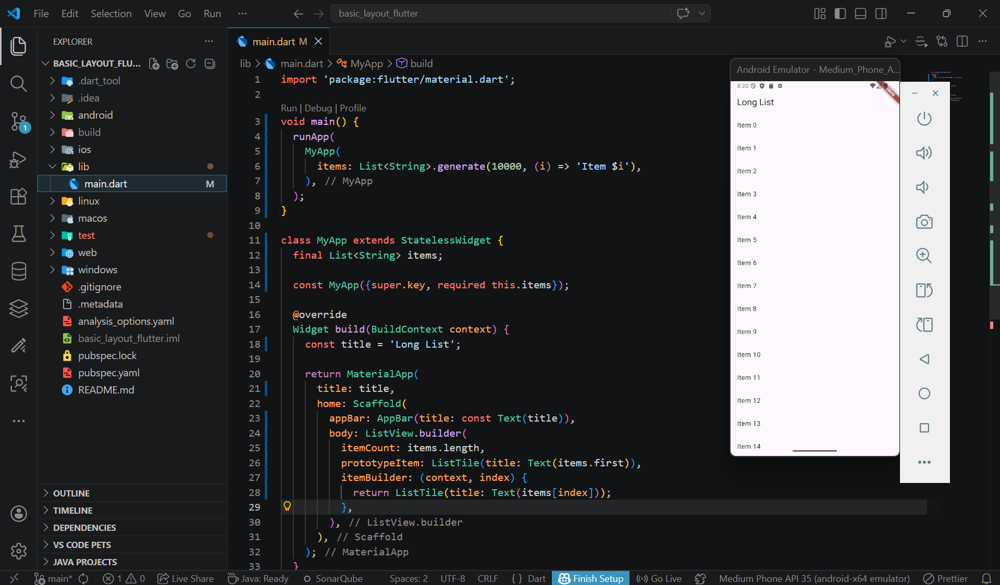
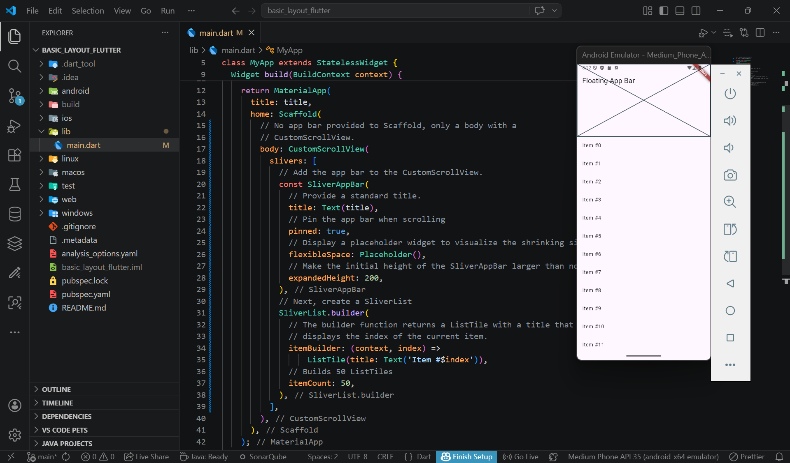
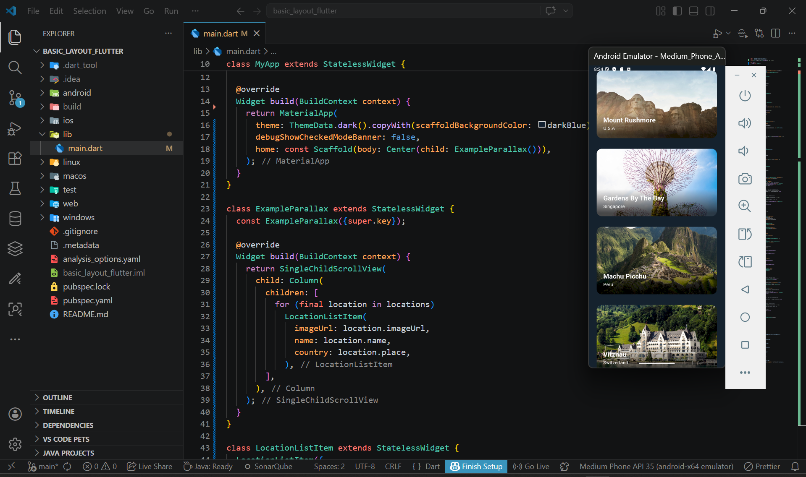

Nama    : Anindya Naura Putri Azzahra
NIM     : 244107060051
Kelas   : SIB 2G

PRAKTIKUM Tugas Praktikum 1
Basic List

--> Pada praktikum ini, saya mempelajari penggunaan widget ListView dan ListTile pada Flutter untuk membuat daftar sederhana. Widget ListView digunakan untuk menampilkan elemen dalam bentuk list yang dapat di-scroll, sedangkan ListTile digunakan untuk menyusun setiap item list yang berisi ikon dan teks. Melalui praktikum ini, dapat dipahami cara membuat tampilan daftar yang rapi, sederhana, dan mudah dibaca dalam aplikasi Flutter, serta bagaimana menggabungkan widget dasar seperti Icon dan Text dalam satu layout

Horizontal List

--> Pada praktikum ini, dipelajari cara membuat horizontal list menggunakan widget ListView di Flutter dengan pengaturan scrollDirection: Axis.horizontal. Dengan konfigurasi ini, item list dapat digeser secara mendatar (horizontal) sehingga cocok untuk menampilkan banyak konten dalam satu baris

Grid List

--> Pada praktikum ini, saya mempelajari penggunaan widget GridView pada Flutter untuk menampilkan data dalam bentuk grid (kotak-kotak) menggunakan GridView.count. Dengan pengaturan crossAxisCount: 2, tampilan dibagi menjadi dua kolom sehingga item dapat tersusun lebih rapi dan terstruktur. Selain itu, juga digunakan List.generate untuk membuat banyak item secara otomatis berdasarkan indeks

Create lists with different types of items

--> Pada praktikum ini, dipelajari penggunaan ListView.builder untuk menampilkan daftar data dalam jumlah besar. Dengan teknik ini, item hanya dibuat saat diperlukan sehingga lebih hemat memori dan meningkatkan performa aplikasi. Selain itu, saya juga mempelajari konsep polymorphism sederhana melalui penggunaan class ListItem dengan dua turunan yaitu HeadingItem dan MessageItem. Setiap tipe item memiliki tampilan berbeda pada judul dan subjudul

List with spaced items

--> Pada praktikum ini, dipelajari cara mengatur tata letak widget menggunakan Column, LayoutBuilder, dan SingleChildScrollView pada Flutter. Kombinasi widget ini digunakan agar tampilan tetap responsif dan dapat menyesuaikan ukuran layar perangkat. Selain itu, juga digunakan ConstrainedBox untuk memastikan tinggi minimum layout sesuai dengan layar, serta Card widget untuk menampilkan item secara rapi

Work with long lists

--> Pada praktikum ini, saya mempelajari penggunaan ListView.builder untuk menampilkan data dalam jumlah besar pada Flutter. Widget ini hanya membangun item yang sedang ditampilkan di layar, sehingga lebih hemat memori dan meningkatkan performa aplikasi. Selain itu, juga digunakan properti prototypeItem untuk membantu Flutter menentukan ukuran item secara konsisten agar proses rendering lebih optimal

Place a floating app bar above a list

--> Pada praktikum ini, dipelajari penggunaan CustomScrollView dan SliverAppBar pada Flutter untuk membuat tampilan aplikasi yang lebih dinamis. SliverAppBar memungkinkan app bar memiliki efek fleksibel seperti membesar dan mengecil saat melakukan scroll. Selain itu, SliverList.builder digunakan untuk menampilkan daftar item secara efisien di dalam scroll view

Create a scrolling parallax effect

--> Pada praktikum ini, saya mempelajari pembuatan efek parallax scrolling pada Flutter menggunakan widget seperti SingleChildScrollView, Stack, Flow, dan Custom FlowDelegate. Efek parallax membuat gambar latar bergerak dengan kecepatan berbeda dibandingkan konten utama sehingga menghasilkan tampilan yang lebih dinamis dan menarik. Selain itu, saya juga menggunakan RenderObject dan pengelolaan posisi scroll untuk menghitung pergerakan elemen secara real-time