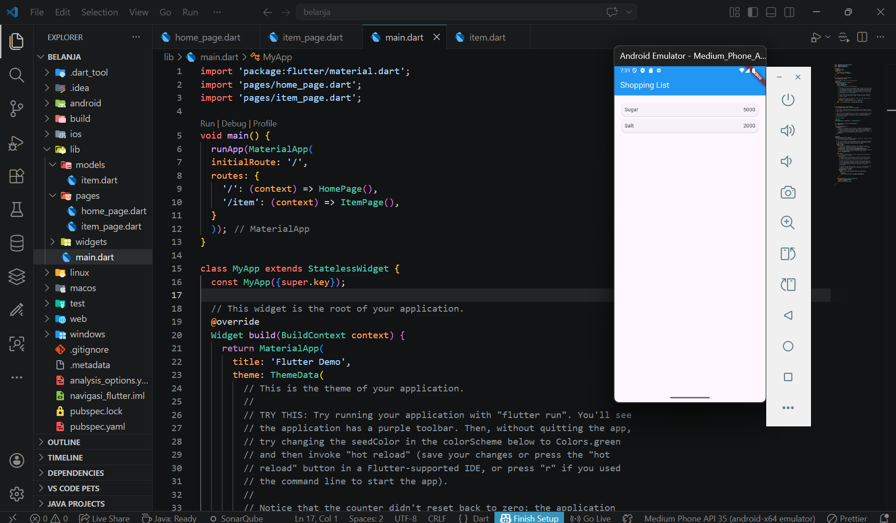

Nama    : Anindya Naura Putri Azzahra
NIM     : 244107060051
Kelas   : SIB 2G

PRAKTIKUM 5 dan Tugas Praktikum 2

Praktikum 5 (Langkah 1-6)

--> This practicum helps in understanding the basics of building a multi-page Flutter application using routing (navigation). It starts with creating a well-organized project structure, then defining pages (HomePage and ItemPage), and managing navigation between them using named routes in main.dart. In addition, this practicum introduces the concept of a data model through the Item class to store product information. In its implementation, data is displayed using ListView.builder, allowing the item list to be rendered dynamically and efficiently

Praktikum 5 (Langkah 7)
.png)
--> In this practicum, interaction is added to the ListView so that each item is not only displayed but also responds to user actions. By using the InkWell widget, each item is given a touch effect along with a navigation function. When an item is tapped, the application navigates to another page using Navigator.pushNamed with a predefined route

Tugas Praktikum 2 (No 1-5)
.png)
--> In this practicum, the Flutter application is further developed to become more complex by adding data transfer between pages using Navigator.pushNamed with arguments, as well as retrieving the data using ModalRoute. This allows item details to be displayed dynamically on the ItemPage

In addition, the application is enhanced in terms of visual appearance and user experience by adding attributes such as product images, stock, and ratings, as well as changing the layout to a GridView to resemble a modern marketplace application. The implementation of the Hero widget provides smoother and more engaging page transition animations.

The code structure is also improved by breaking widgets into smaller components, making the code cleaner and easier to manage

Tugas Praktikum 2 (No 6)
.png)
--> In this practicum, Flutter application navigation is further developed by using the plugin go_router as an alternative to the built-in Navigator. The use of go_router makes route management more structured, declarative, and easier to understand, especially for applications with many pages.
With go_router, page transitions, data passing (parameters), and route configuration become cleaner and more scalable compared to the previous method. In addition, integration with features such as Hero animations and GridView layouts can still be implemented effectively