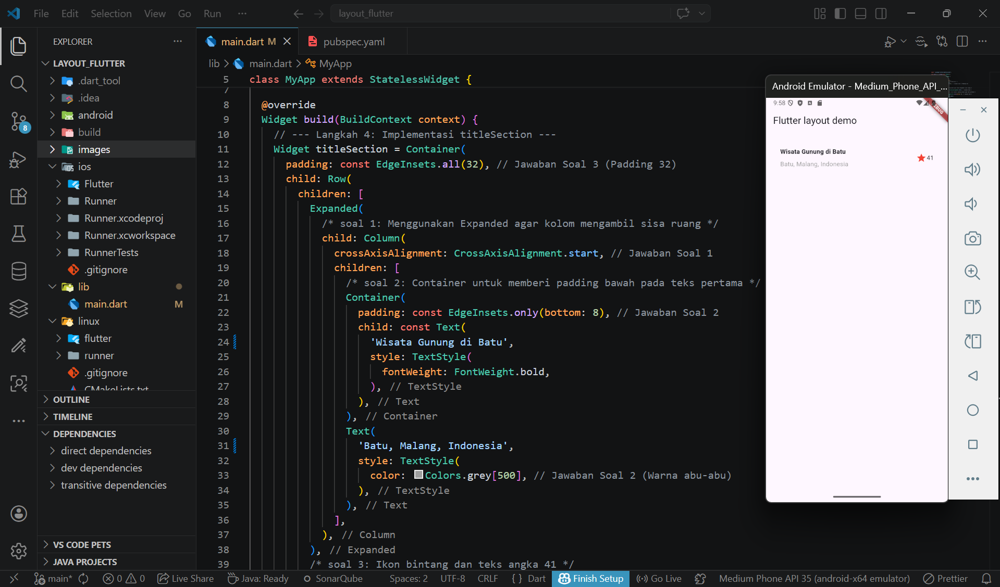
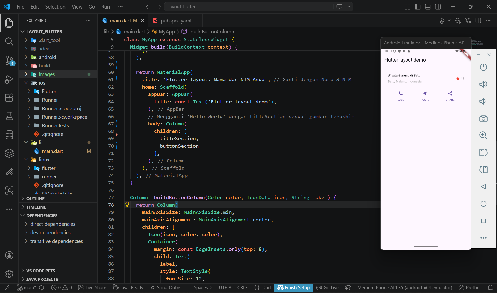
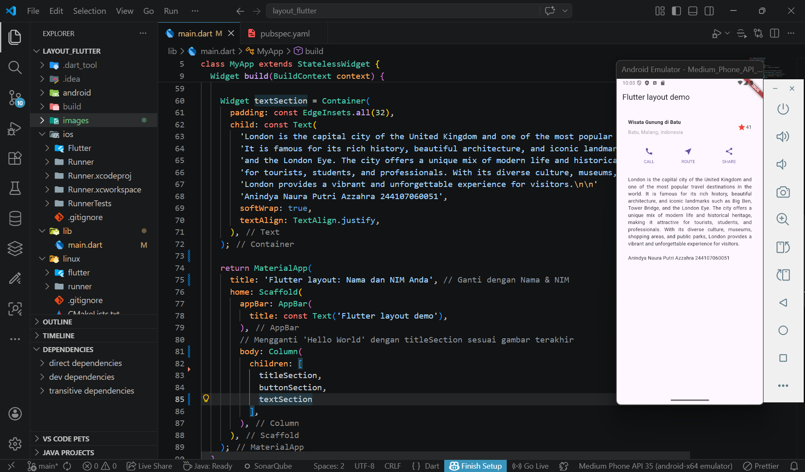
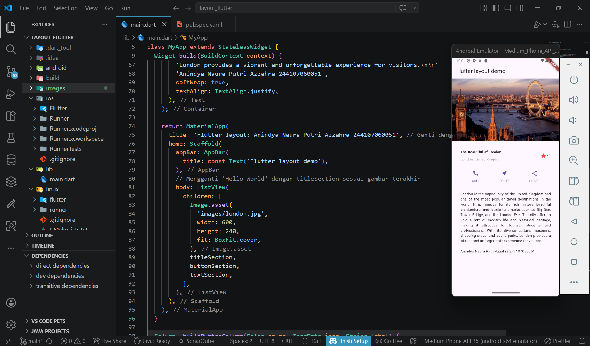

Nama    : Anindya Naura Putri Azzahra
NIM     : 244107060051
Kelas   : SIB 2G

PRAKTIKUM 1-4

Praktikum 1

--> In this practicum, I learned the basics of layout in Flutter using widgets such as Container, Row, Column, Expanded, Icon, and Text. The arrangement of widgets is structured to align both horizontally and vertically according to the needs of the application’s interface. In addition, properties like crossAxisAlignment, padding, and text styling are applied to organize the layout and enhance the overall appearance of the UI

Praktikum 2

--> In this practicum, I learned how to create button components in Flutter using a modular widget approach. A function called _buildButtonColumn is used to construct a column of buttons containing icons and text with consistent styling, making the code more efficient and reducing redundancy. Additionally, the Row widget with the MainAxisAlignment.spaceEvenly property is applied to arrange the buttons with equal spacing. As a result, the UI becomes cleaner, more structured, and easier to maintain. This practicum highlights the importance of reusable widgets in building Flutter interfaces

Praktikum 3

--> In this practicum, I learned how to add text into a Flutter layout using the Container widget. Padding is applied to the textSection widget to ensure the text has proper spacing from the edges of the screen. Additionally, the softWrap: true property is used so that the text automatically wraps according to the screen width. This practicum helps in understanding how to manage text layout in a Flutter application to make it more structured and readable

Praktikum 4

--> In this practicum, I learned how to add image assets to a Flutter application by using an images folder and configuring it in the pubspec.yaml file. The images are then displayed using the Image.asset widget with the BoxFit.cover property to ensure they fit properly within the layout. Additionally, I applied the ListView widget to replace Column, allowing the layout to become scrollable when the content exceeds the screen size. This makes the application more flexible and responsive across different device sizes. This practicum helped me understand asset management, image usage, and the concept of scrollable layouts in Flutter